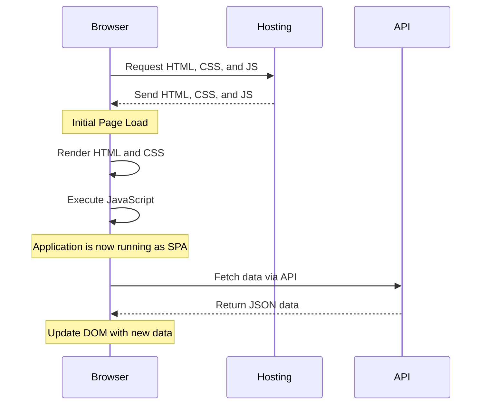
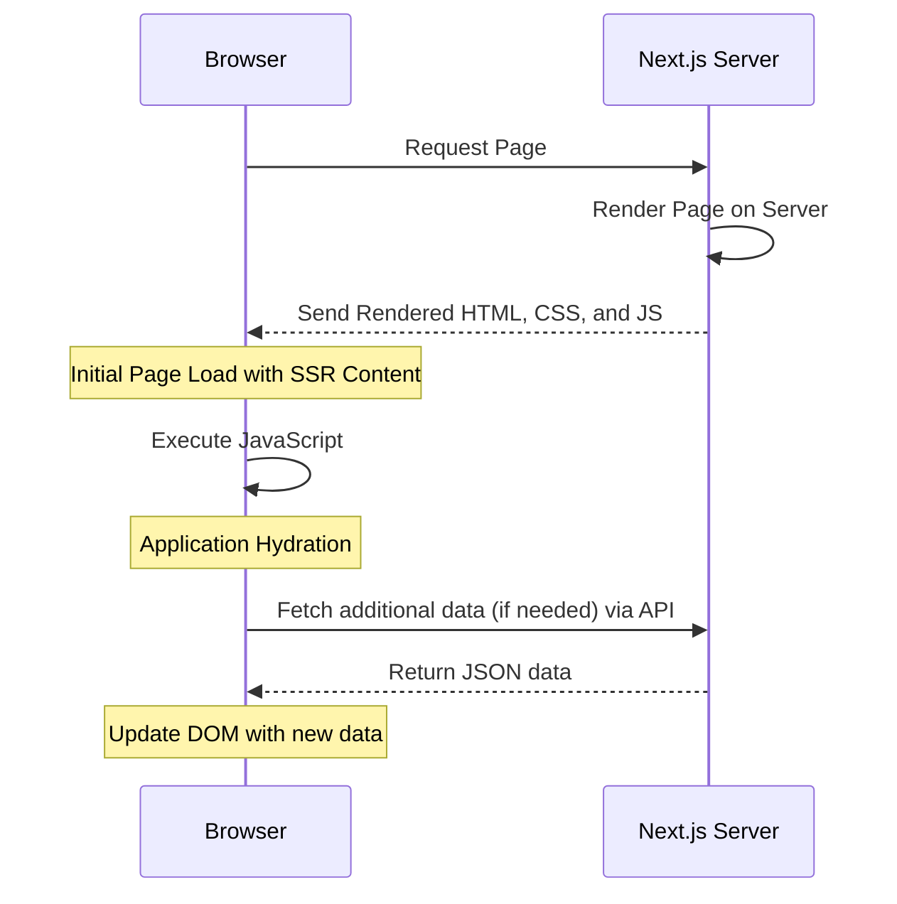

# Next.js Introduction

---

# Brief History of Web Application

  

---

# Multi Page Application

- Multiple entry points

- Content are rendered on the server. HTML, CSS, and JavaScript code for each page is generated on the server and then sent to the client's browser

- When a user navigates to a new page, the browser send a new request to the server.

- Consider a “Server Side Rendering” because everything is rendered on the server

---

# Multi Page Application

- Long history of successful implementation in various industries and domains

- SEO-friendly since everything is rendered on the server

- Straightforward and easier to understand for a simple project

- Higher server resource requirements, potentially raising hosting costs

- Slower interactivity, especially for frequent updates

---

# Single Page Application

- Single entry point

- The browser only get the “Shell” HTML, CSS, and JavaScript. UI is rendered by JavaScript.

- When a user navigates to a new page, JavaScript replace the HTML with the new UI.

- Consider “Client Side Rendering” because most of the content is rendered on the browser

---

# Single Page Application

- Dynamic content updates without constant page refreshing.

- Minimize server requests, reducing bandwidth usage

- Suited for web applications requiring high interactivity

- SEO challenges due to the content is loaded on the browser with JavaScript

- The initial load time can be extended as the entire app code loads upfront

---

# Server Side Rendering

- Multiple entry points\*

- Content are rendered on the server, Like Multi Page Application (MPA).

- After the initial request, every navigation behave like Single Page Application (SPA)

<small>\* Each page is rendered on the server in response to a request from the browser</small>

---

# Server Side Rendering

- SEO-friendly since everything is rendered on the server

- Minimize server requests, reducing bandwidth usage

- Suited for web applications requiring high interactivity

- Complexity in managing the transition between server and client (Hydration)

- It also introduces complexities and potential trade-offs, representing both the best and worst of both worlds.

---
layout: two-cols
---

# What's Next.js

- **React Framework**  
  Built on top of React to enhance its capabilities for production applications.

- **Designed with SSR in Mind**  
  Supports server-side rendering, data fetching, code-splitting, and more.

- **Flexible and Scalable**  
  Suitable for everything from simple static sites to server-side rendering, and can be self-hosted or deployed to the cloud.

- **Mature Community**  
  Backed by Vercel and widely used by large enterprises.

:: right ::

<svg xmlns="http://www.w3.org/2000/svg" viewBox="0 0 180 180" width="180"><mask height="180" id=":r8:mask0_408_134" maskUnits="userSpaceOnUse" width="180" x="0" y="0" style="mask-type: alpha;"><circle cx="90" cy="90" fill="black" r="90"></circle></mask><g mask="url(#:r8:mask0_408_134)"><circle cx="90" cy="90" data-circle="true" fill="black" r="90"></circle><path d="M149.508 157.52L69.142 54H54V125.97H66.1136V69.3836L139.999 164.845C143.333 162.614 146.509 160.165 149.508 157.52Z" fill="url(#:r8:paint0_linear_408_134)"></path><rect fill="url(#:r8:paint1_linear_408_134)" height="72" width="12" x="115" y="54"></rect></g><defs><linearGradient gradientUnits="userSpaceOnUse" id=":r8:paint0_linear_408_134" x1="109" x2="144.5" y1="116.5" y2="160.5"><stop stop-color="white"></stop><stop offset="1" stop-color="white" stop-opacity="0"></stop></linearGradient><linearGradient gradientUnits="userSpaceOnUse" id=":r8:paint1_linear_408_134" x1="121" x2="120.799" y1="54" y2="106.875"><stop stop-color="white"></stop><stop offset="1" stop-color="white" stop-opacity="0"></stop></linearGradient></defs></svg>
<svg xmlns="http://www.w3.org/2000/svg" viewBox="0 0 394 79" width="240"><path d="M261.919 0.0330722H330.547V12.7H303.323V79.339H289.71V12.7H261.919V0.0330722Z"></path><path d="M149.052 0.0330722V12.7H94.0421V33.0772H138.281V45.7441H94.0421V66.6721H149.052V79.339H80.43V12.7H80.4243V0.0330722H149.052Z"></path><path d="M183.32 0.0661486H165.506L229.312 79.3721H247.178L215.271 39.7464L247.127 0.126654L229.312 0.154184L206.352 28.6697L183.32 0.0661486Z"></path><path d="M201.6 56.7148L192.679 45.6229L165.455 79.4326H183.32L201.6 56.7148Z"></path><path clip-rule="evenodd" d="M80.907 79.339L17.0151 0H0V79.3059H13.6121V16.9516L63.8067 79.339H80.907Z" fill-rule="evenodd"></path><path d="M333.607 78.8546C332.61 78.8546 331.762 78.5093 331.052 77.8186C330.342 77.1279 329.991 76.2917 330 75.3011C329.991 74.3377 330.342 73.5106 331.052 72.8199C331.762 72.1292 332.61 71.7838 333.607 71.7838C334.566 71.7838 335.405 72.1292 336.115 72.8199C336.835 73.5106 337.194 74.3377 337.204 75.3011C337.194 75.9554 337.028 76.5552 336.696 77.0914C336.355 77.6368 335.922 78.064 335.377 78.373C334.842 78.6911 334.252 78.8546 333.607 78.8546Z"></path><path d="M356.84 45.4453H362.872V68.6846C362.863 70.8204 362.401 72.6472 361.498 74.1832C360.585 75.7191 359.321 76.8914 357.698 77.7185C356.084 78.5364 354.193 78.9546 352.044 78.9546C350.079 78.9546 348.318 78.6001 346.75 77.9094C345.182 77.2187 343.937 76.1826 343.024 74.8193C342.101 73.456 341.649 71.7565 341.649 69.7207H347.691C347.7 70.6114 347.903 71.3838 348.29 72.0291C348.677 72.6744 349.212 73.1651 349.895 73.5105C350.586 73.8559 351.38 74.0286 352.274 74.0286C353.243 74.0286 354.073 73.8286 354.746 73.4196C355.419 73.0197 355.936 72.4199 356.296 71.6201C356.646 70.8295 356.831 69.8479 356.84 68.6846V45.4453Z"></path><path d="M387.691 54.5338C387.544 53.1251 386.898 52.0254 385.773 51.2438C384.638 50.4531 383.172 50.0623 381.373 50.0623C380.11 50.0623 379.022 50.2532 378.118 50.6258C377.214 51.0075 376.513 51.5164 376.033 52.1617C375.554 52.807 375.314 53.5432 375.295 54.3703C375.295 55.061 375.461 55.6608 375.784 56.1607C376.107 56.6696 376.54 57.0968 377.103 57.4422C377.656 57.7966 378.274 58.0874 378.948 58.3237C379.63 58.56 380.313 58.76 380.995 58.9236L384.14 59.6961C385.404 59.9869 386.631 60.3778 387.802 60.8776C388.973 61.3684 390.034 61.9955 390.965 62.7498C391.897 63.5042 392.635 64.413 393.179 65.4764C393.723 66.5397 394 67.7848 394 69.2208C394 71.1566 393.502 72.8562 392.496 74.3285C391.491 75.7917 390.043 76.9369 388.143 77.764C386.252 78.582 383.965 79 381.272 79C378.671 79 376.402 78.6002 374.493 77.8004C372.575 77.0097 371.08 75.8463 370.001 74.3194C368.922 72.7926 368.341 70.9294 368.258 68.7391H374.235C374.318 69.8842 374.687 70.8386 375.314 71.6111C375.95 72.3745 376.78 72.938 377.795 73.3197C378.819 73.6923 379.962 73.8832 381.226 73.8832C382.545 73.8832 383.707 73.6832 384.712 73.2924C385.708 72.9016 386.492 72.3564 387.055 71.6475C387.627 70.9476 387.913 70.1206 387.922 69.1754C387.913 68.312 387.654 67.5939 387.156 67.0304C386.649 66.467 385.948 65.9944 385.053 65.6127C384.15 65.231 383.098 64.8856 381.899 64.5857L378.081 63.6223C375.323 62.9225 373.137 61.8592 371.541 60.4323C369.937 59.0054 369.143 57.115 369.143 54.7429C369.143 52.798 369.678 51.0894 370.758 49.6261C371.827 48.1629 373.294 47.0268 375.148 46.2179C377.011 45.4 379.114 45 381.456 45C383.836 45 385.92 45.4 387.719 46.2179C389.517 47.0268 390.929 48.1538 391.952 49.5897C392.976 51.0257 393.511 52.6707 393.539 54.5338H387.691Z"></path></svg>

---

# Next.js build options

- SSG (Static Site Generation): Pre-renders pages at build time.

- ISR (Incremental Static Regeneration): Updates static content on-demand.

- SSR (Server-Side Rendering): Renders pages on the server at request time.
